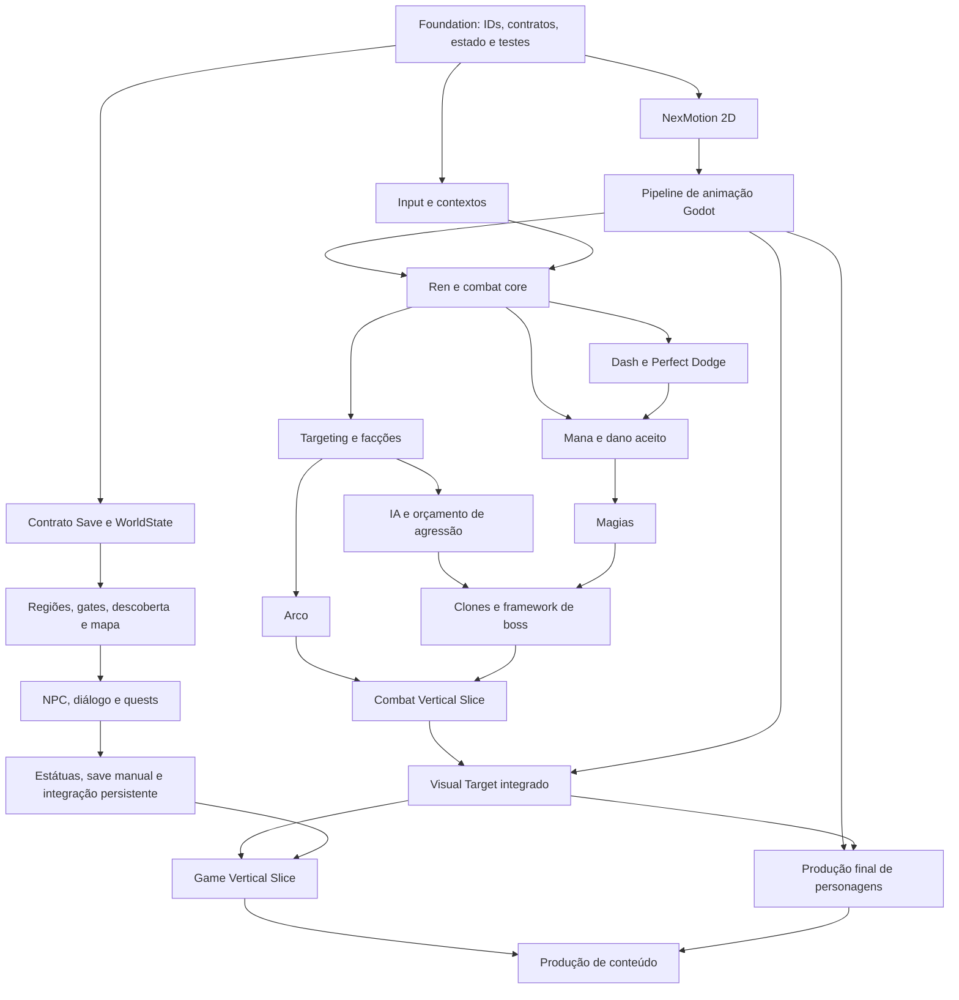

# Plano de migração — proposta após Etapa 0

**Atualização de execução:** Foundation mínima e NexMotion 2D foram autorizados e concluídos em 06/10/2026, conforme [[60_Producao/Relatorio_Etapas_1_2]]. A implementação efetiva está nesse relatório; o restante desta arquitetura continua proposta. Etapa 3 não iniciada.

Fundamento: [[60_Producao/Auditoria_Etapa_0]], [[60_Producao/Matriz_Reaproveitamento]] e [[60_Producao/Baseline_Etapa_0]]. **Etapas futuras não executadas nem aprovadas automaticamente.** O protótipo preservado será referência comparável, não renomeado em massa.

## Arquitetura alvo compacta

| Responsabilidade | Proposta | Origem / limite |
|---|---|---|
| Partida | `GameSession` cria/encerra uma sessão e coordena pause/menus | Extrair de game; sem falas, coordenadas ou movesets |
| Estado persistente | `WorldState` com IDs de regiões, bosses, quests, magias, upgrades, checkpoints e atalhos | Substitui stage global; não serializa árvore de Nodes |
| Persistência | `SaveStore` I/O + codec/validador/migrações | Adaptar fluxo temporário/backup; preservar save legado |
| Player | Cena `CharacterBody2D`, controller pequeno + combat/evade/magic/bow por composição | Reusar movimento, dano e evasão; evitar uma classe por cada microestado |
| Dano e alvos | Hitbox/Hurtbox + payload de hit, facção e alvo elegível | Preservar retorno de aceitação; não depender de `game.player` |
| Animação | `CharacterAnimationSet` e presenter consumindo SpriteFrames gerado | NexMotion fornece dados; gameplay controla execução/cancelamento |
| IA | Cena de ator, EnemyDefinition e ações locais; TargetProvider | Reusar estados, rotas, resistência; não herdar Ren para fazer clones |
| Encontros | EncounterDefinition (Resource) + instância por região + AggressionCoordinator | Conteúdo fora do scheduler; ownership de perigos/summons por tentativa |
| Boss | BossController, dados de fases/ações, arena e presenter | Mesmo ciclo em 11 encontros, ações especiais compostas onde necessário |
| Mundo | Cenas de região, TileSet compartilhado, props/interações/spawns em cenas | IDs estáveis e conexões em dados; scripts gerenciam fluxo |
| Diálogos/missões | Dados de falas/condições e objetivos por eventos | Pequeno resolver; não criar linguagem completa de quests |
| UI/áudio/FX | Cenas de widgets, modelos/sinais e serviços leves | Não precisam conhecer classe Jinzō, IDs antigos ou posição de árvore |

Manter `CharacterBody2D`, `Area2D`, `TileMapLayer`, Resources e sinais. Recursos guardam configuração imutável; estado de cooldown, HP e alvos atingidos fica na instância. Scenes guardam composição/posicionamento; código guarda regras. Não criar ECS, banco de dados, container de DI, rede, streaming de mundo inteiro ou pooling geral sem medição.

## Dependências

O grafo não obriga esperar a arte final para testar contratos. Pode-se validar com referências existentes e fixtures, sem promovê-las a assets finais. Proposta de trabalho por fases, não autorização para paralelizar agentes.

## Sequência e saídas verificáveis

| Etapa | Entrega proposta | Critério de saída |
|---|---|---|
| **1 — Foundation** | Fronteira entre legado e novo runtime; IDs, facções/contrato de dano, sessão/reset, schema inicial de WorldState/save, convenções de animação e runner de regressão | Carregar/iniciar/encerrar sandbox isolado, round-trip de estado mínimo e reset sem resíduos; testes do legado intactos; sem personagens finais ou campanha |
| 2 — NexMotion 2D | Biblioteca, preview, timeline, versões/status e export neutro | Clips existentes importados sem destruir origem; retângulos/pivôs/FPS/loops validados e comparação reproduzível |
| 3 — Pipeline NexMotion ↔ Godot | Importador PNG+JSON→SpriteFrames+metadata Resource | Round-trip determinístico; pivô/direções/eventos/cancelamento exercitados com fixture; erros de schema claros |
| 4 — Ren / katana core | Controller, sequências, direção entre golpes e buffer | Todas as rotas aprovadas, multialvo/single-hit, dano só ativo, paredes e recuperação; arte final depende de pipeline/aprovação |
| 5 — Dash / Perfect Dodge / Mana | Evasão, cancelamentos autorizados, recuperação por dano aceito/esquiva | Janela perfeita uma vez, nenhum parry, cooldown e interrupção coerentes; testes de relógio/hitstop |
| 6 — Targeting / arco | Contextos L2/R2, seleção e troca com right stick, feedback e projétil | Alvo inválido/oculto/morto, sem alvo, troca discreta e colisão; contratos ambientais testados |
| 7 — Base de IA e grupos | TargetProvider com facções, navegação, separação e coordenador de agressão | Grupos mistos e hazards sob limite legível; alvo pode sair/morrer; nenhum token perdido; medir carga |
| 8 — Magias e aliados | Catálogo fixo, seleção, Fogo/Impacto/Tornado/Clones | Custos, desbloqueio, resistências, lifetime, dois clones e não recursão; clones já apoiados pela IA da etapa 7 |
| 9 — Boss framework + Combat Vertical Slice | Arena reutilizável com ações representativas, reset e combate combinado | Fases/transição única/duas apresentações, summons/perigos limpos, morte/retry/vitória; validação humana de controle e pressão |
| 10 — World systems | Regiões em cenas, conexões, gates/atalhos, descoberta/mapa/minimapa | Ir/voltar entre regiões, evitar duplicar entidades, persistir descoberta e gates; sem depender de stage linear |
| 11 — NPC / diálogo / quests | Condições por estado, objetivos/eventos/recompensas | Conversa muda após evento, recompensa única, quest preservada ao revisitar/carregar |
| 12 — Checkpoint / save completo | Estátuas, autosave/manual e integração de todos os estados | Fechar/reabrir, morte/boss retry, backup inválido, migrações, interrupção de escrita e progresso persistente |
| 13 — Visual Target | Arte/UI/áudio/VFX representativos integrados ao gameplay | Revisão humana em jogo, escala/pivôs/leitura de telegraphs, desempenho gráfico; não apenas menu bonito |
| 14 — Game Vertical Slice | Trecho narrativo e exploração representativos com todos os sistemas | Percurso real por inputs, save/revisitação, opcionais representativos e avaliação humana; escopo concreto definido depois |
| 15 — Content production | Regiões e elenco aprovados usando a infraestrutura validada | Conteúdo incremental, testes por região/boss, balanceamento e checklist de build/distribuição |

## Por que a ordem mudou

- **Contrato de save antecipado para Foundation**, antes de criar novos IDs espalhados. A experiência final de save/checkpoints permanece na etapa 12. Não vale investir em persistência no final sem modelo comum.
- **Targeting/facções e base de IA antes de Clones.** O código atual só mira Ren; invocar aliados primeiro criaria uma falsa implementação que não divide aggro. Magias simples podem ser prototipadas após Mana; conclusão do conjunto depende de IA.
- **Framework de boss antes de conteúdo.** Integrado ao slice de combate, para provar reset/fases/perigos uma vez. Jinzō é referência de teste, não moveset genérico obrigatório.
- **Convenções de escala/pivô cedo**, em Foundation/pipeline. O Visual Target artístico permanece depois; evitar que escolha tardia de dimensão quebre todas as animações. NexMotion precisa de um contrato mínimo antes de virar ferramenta.
- **Gates/WorldState cedo, mapa físico depois do combate.** Contratos evitam retrabalho, sem desenhar prematuramente 12 mapas.

## Etapa 1 exata a autorizar

**Foundation técnica mínima de Kuroyomi, com protótipo Amahara congelado como baseline.** Definir localização da nova raiz/runtime dentro do mesmo repositório sem renomeá-lo; registrar decisão de save namespace e compatibilidade; criar somente contratos e sandbox necessários para provar ciclo de sessão, facção/dano, IDs/estado persistente e formato de animação. Separar critérios de teste de regras numéricas antigas. Consolidar o mapeamento planejado (incluindo Touchpad/Options) na fonte de controles antes de implementá-lo.

Não incluir Ren final, quatro magias, novos bosses, novas regiões nem desenvolvimento do NexMotion nessa Etapa 1. O próximo marco não é “jogo pronto”: é uma fundação pequena e verificável sobre a qual o pipeline e o core possam crescer.
